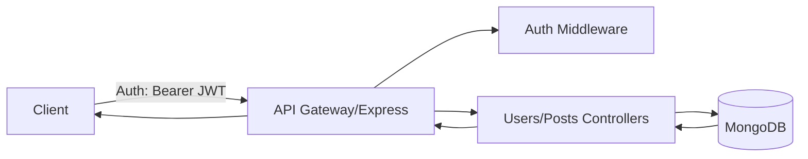
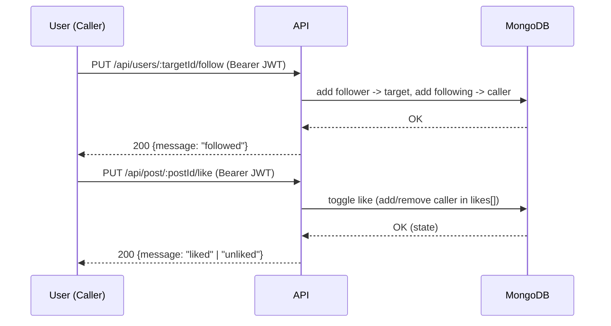

# 📱 Social Media Backend API

This project is a **Node.js + Express + MongoDB** backend for a simple social media application.  
It includes user authentication, following/unfollowing users, creating posts, and liking posts.

---

## 🎯 Intended Audience
This documentation is intended for **developers** building or testing social media applications.

---

## 🚀 Features
- User registration & authentication (JWT)  
- User profile management (update, delete, get user)  
- Follow / unfollow other users  
- Create, update, delete posts  
- Timeline feature: see posts from followed users  
- Like / unlike posts  

---

## 🛠️ Installation

1. Clone the repository:
   ```bash
   git clone https://github.com/ohalukkarakaya/nodeJs-social-media-back-end-api.git
   cd nodeJs-social-media-back-end-api
   ```

2. Install dependencies:
   ```bash
   npm install
   ```

3. Create a `.env` file with the following variables:
   ```env
   PORT=3000
   MONGO_URI=mongodb://localhost:27017/socialmedia
   JWT_SECRET=yourSecretKey
   ```

4. Start the server:
   ```bash
   npm start
   ```
   The API will be available at `http://localhost:3000/`

---

## 👤 Authentication

### Register
```http
POST /api/auth/register
Content-Type: application/json

{
  "username": "foo",
  "email": "foo@email.com",
  "password": "1234"
}
```

### Login
```http
POST /api/auth/login
Content-Type: application/json

{
  "email": "foo@email.com",
  "password": "1234"
}
```

✅ **Response**
```json
{
  "status": true,
  "token": "eyJhbGciOiJIUzI1..."
}
```

Use this token in the `Authorization` header as `Bearer <token>` for all protected routes.

---

## 👥 User Routes

| Route | Method | Body / Header | Description |
|-------|--------|---------------|-------------|
| `/api/users/:id` | `PUT` | header: `{ userId }`, body: `{ username, email, profilePicture, coverPicture, isAdmin, desc }` | Update user info |
| `/api/users/:id` | `DELETE` | header: `{ userId }` | Delete user |
| `/api/users/:id` | `GET` | – | Get a single user |

---

## ➕ Follow / Unfollow

| Route | Method | Header | Description |
|-------|--------|--------|-------------|
| `/api/users/:targetId/follow` | `PUT` | `{ userId }` | Follow another user |
| `/api/users/:targetId/unfollow` | `PUT` | `{ userId }` | Unfollow a user |

---

## 📝 Post Routes

| Route | Method | Body / Header | Description |
|-------|--------|---------------|-------------|
| `/api/post/:id` | `GET` | – | Get a specific post |
| `/api/post` | `POST` | `{ userId, desc, img }` | Create a new post |
| `/api/post/:id` | `PUT` | `{ userId, desc, img }` | Update a post |
| `/api/post/:id` | `DELETE` | header: `{ userId }` | Delete a post |
| `/api/post/timeline/all` | `GET` | header: `{ userId }` | Get timeline (posts from followed users) |

---

## 👍 Like / Unlike

| Route | Method | Header | Description |
|-------|--------|--------|-------------|
| `/api/post/:id/like` | `PUT` | `{ userId }` | Like/unlike a post |

---

## 📊 Example Usage Flow

1. Register a new user  
2. Login and receive a JWT token  
3. Follow another user  
4. Create a new post  
5. Fetch your timeline to see posts from followed users  
6. Like a post  

---

## 📈 System Flow Diagram


---

## Follow & Like Sequence



---

## ⚠️ Error Handling

- `401`: Invalid/missing token
- `403`: Unauthorized action (updating someone else's profile, etc.)
- `404`: User/post not found
- `409`: Already followed/already liked
- `500`: Server error

